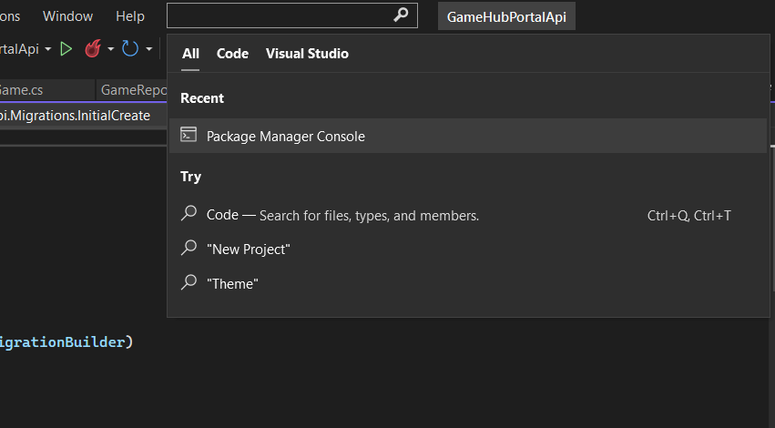
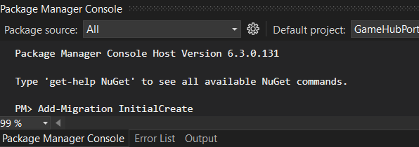
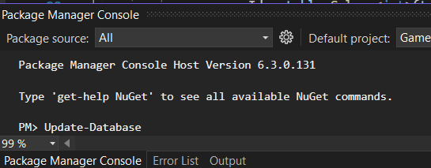
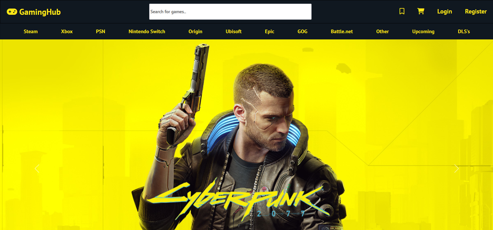
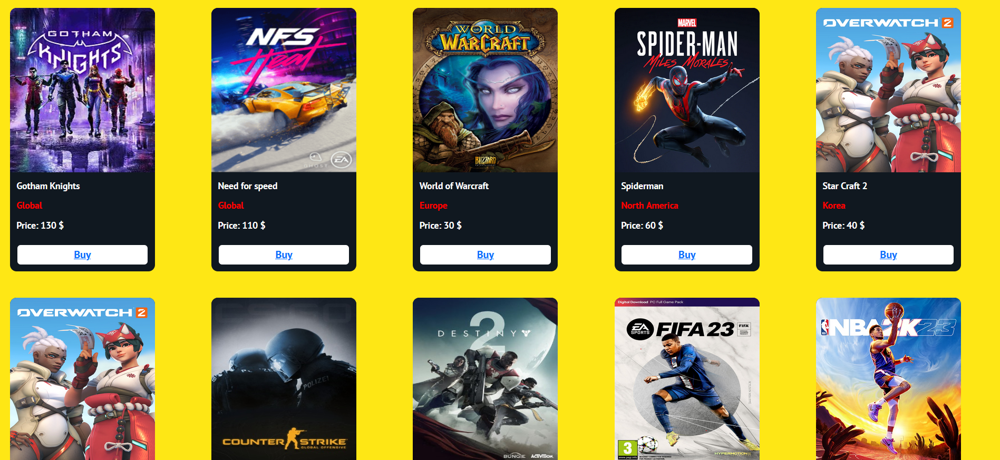
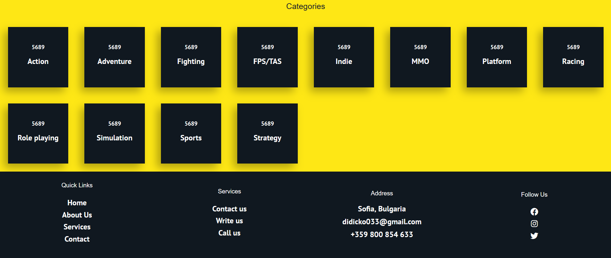
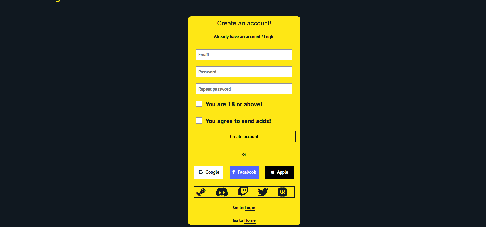
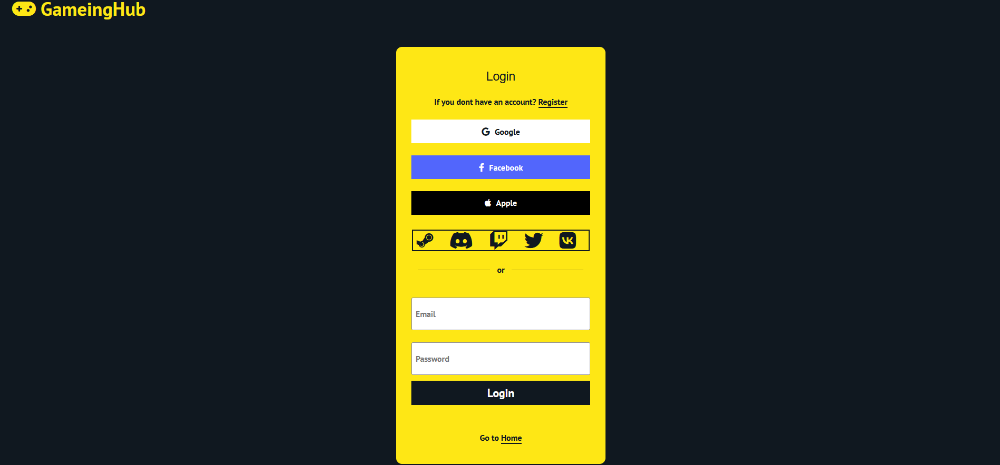
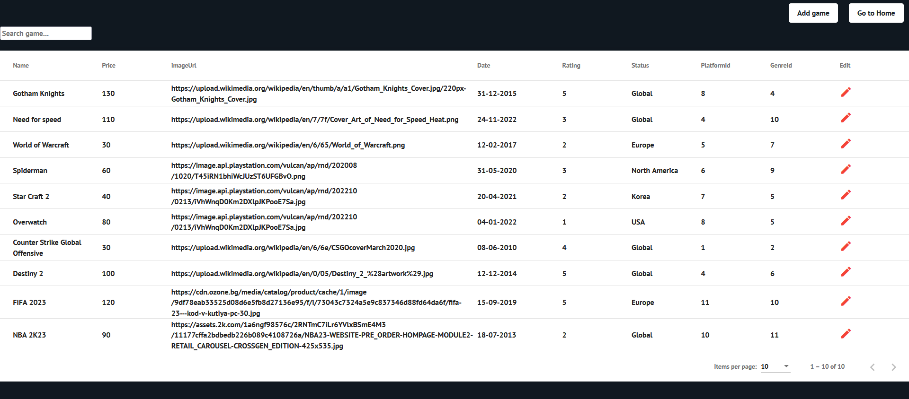

# GameHub Project
An Angular frontend for a website which is supposed to sell "CD" Keys for games, DLC's and other products which can be activated on different gaming platforms.

# Used Technologies
* Angular framework
* [C# ASP.NET API](https://github.com/David-Popov/GameHub-Project/tree/main/GameHubPortalApi)
* .NET Framework
* JWT
* Bootstrap
* SQL Server
* Handwritten HTML and CSS

# What the project contains
The project is divided into two parts. The first contains the Angular project and the other contains the C# API. After downloading the project, you need to open the C# API to create the migrations, which help you to create database is then created.

* Step 1: Open Package Manager in Visual Studio

* Step 2: Type "Add-Migration InitialCreate"

* Step 3: After create Migration type "Update-Database"

* Step 4: Рun GameGubPortalApi to create the database presets.

# Accounts that you can use after creating Database

* Admin account: Email - "admin@gmail.com" || Password - "admin1234"

* Account: Email - "user1@gmail.com" || Password - "user1"

* Account: Email - "user2@gmail.com" || Password - "user2"

# Website screenshots

# Register

# Login

# Admin Page

* Accessible only when you are logged with admin account. You can make CRUD operations while in that page.

